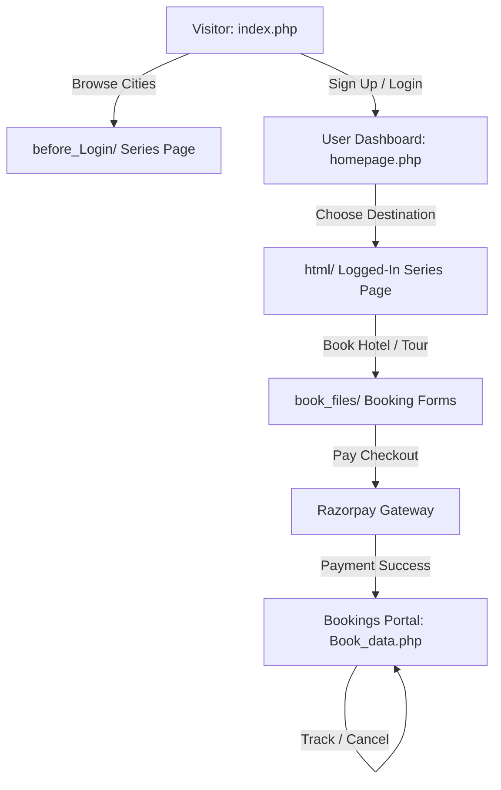

# UI/UX & Design Architecture Report: `travel_india-new`

This document details the visual style, typography, color palette, interactive animations, coding conventions (sizing units), and flow logic that constitute the front-end design system of the **The Real Travel** booking platform.

---

## 🎨 1. Theme & Design Language
The project is styled as a premium, editorial-grade dark-themed web experience inspired by travel themes from *"The Real Housewives"*. It leverages high-contrast minimalism, crisp custom typography, and dynamic micro-interactions to create a luxury brand feel.

---

## 🅰️ 2. Typography System
The application uses a custom-defined typography hierarchy loaded via `@font-face` rather than standard system fonts.

| Font Family Name | Source Asset / Font File | Style & Purpose |
| :--- | :--- | :--- |
| **`twl`** | `Aeonik-Regular.ttf` | Clean, modern sans-serif. Used for body text, lists, table elements, and navigation labels. |
| **`Aeonik`** | `Aeonik-Medium.woff2` | Bold, structured sans-serif. Used for prominent subtitles and sub-headers. |
| **`regular`** | `Tartuffo-Regular.ttf` | Elegant editorial serif. Used for main headings, city titles, and quotes. |
| **`regular2`** | `Tartuffo-Light.ttf` | Lighter serif variant. Used for elegant descriptions and tagline accents. |
| **`pp`** | `PPFragment-SerifRegular.ttf` | Editorial accent serif. Used for decorative section titles. |

---

## 🎨 3. Color Palette
To build a luxury contrast profile, the app implements a dark carbon base accented by energetic neon highlights.

*   **Primary Background**: `#0b0a0e` (Rich Carbon Black)
*   **Primary Text**: `#f3f1f1` (Warm Soft-White for eye-comfort readability)
*   **Highlights & Primary Links**: `chartreuse` / `#adff2f` (used for active states, user identifiers, and focus items)
*   **Call-to-Actions & Alerts**: `darkorange` / `#ff8c00` (used for warning notifications, cancel options, and action buttons)
*   **Borders & Rules**: Thin semi-transparent whites/grays for structured layouts.

---

## 📐 4. Layout & Sizing Unit Conventions (fluid vw & vh scaling)
A signature feature of the project's styling codebase is the exclusive use of **fluid viewport units** (`vw` for Viewport Width and `vh` for Viewport Height) rather than absolute pixel (`px`) definitions. This ensures the entire interface scales proportionally with screen width and height, preserving pixel-perfect alignment across different display ratios.

### Standards Checklist for Sizing & Layout Code:
1.  **Vertical Spacing (`vh`)**:
    *   Heights of full-screen sections: `height: 100vh`
    *   Top margins and offsets: `margin-top: 15vh`
    *   Hero section boundaries: `height: 60vh`
2.  **Horizontal Spacing (`vw`)**:
    *   Paddings and margins: `padding: 2.5vw`, `padding-left: 1vw`
    *   Borders and boundary radii: `border-radius: 0.2vw`, `border-radius: 0.8vw`
    *   Letter spacing: `letter-spacing: 0.1vw`
3.  **Fluid Typography (`vw`)**:
    *   Nav text sizes: `font-size: 0.8vw`
    *   Title sizes: `font-size: 2.5vw`
    *   Main banner headers: `font-size: 8vw`
    *   Body descriptions: `font-size: 1.2vw`

### Code Format Example:
```css
/* fluid, scalable header element */
.middle h2 {
  font-family: regular;
  font-size: 2.5vw;     /* Scales dynamically with screen width */
  line-height: 1.4; 
  text-align: center;
}

/* responsive page nav layout */
.page1 .nav {
  width: 100%;
  height: 10vh;         /* exactly 10% of viewport height */
  padding: 2.5vw;       /* exactly 2.5% of viewport width */
  font-family: twl;
  display: flex;
}
```

---

## ⚡ 5. Animation Engine & Micro-interactions
All page transitions and scroll mechanics are orchestrated using standard JS libraries (`GSAP`, `ScrollTrigger`, `Split-Type`) for a smooth, high-fidelity experience.

### Key Interactions:
1.  **Smooth Inertial Scroll**:
    - Powered by **Lenis** and **Locomotive Scroll**. Disables native browser jumping in favor of smooth, inertia-driven page movement.
2.  **Split-Type Character Reveals**:
    - Large headings (e.g. `.header h1` and `.location h1`) are programmatically split into individual characters using `Split-Type` and staggered upward with GSAP on enter.
3.  **Mouse-Tracking Parallax**:
    - Showcase images react to the user's mouse coordinates. Moving the cursor shifts background layouts using a dampened GSAP animation (`x`/`y` movement multiplied by `0.1` factor over `6` seconds duration).
4.  **Elastic Navigation Overlay**:
    - The main menu overlay slips down with an elastic bounce (`ease: "elastic.out(0.5, 1)"`) when the menu trigger is clicked, accompanied by a letter-by-letter reveal of the links.
5.  **Hover Opacity Stagger**:
    - Hovering over a navigation link in the menu dim-fades all surrounding items to `50%` opacity while scale-focusing the selected item and sliding in its corresponding preview background.

---

## 🔄 6. UI/UX Flow
The user journey is divided into clear functional zones:



### Detailed Flow Steps:
1.  **Anonymous Discovery**:
    - Visitors land on `index.php` and can view general travel cards. Clicking a destination redirects to `before_Login/` pages (e.g. `before_Login/orange-county.php`).
2.  **Authentication Guard**:
    - Users sign up or log in. An OTP verification panel handles multi-factor safety.
3.  **Dashboard Landing**:
    - Once logged in, the user lands on `homepage.php`. The navigation overlay enables quick jumping to custom pages.
4.  **Premium Booking**:
    - In the logged-in views (`html/` series pages), users click booking buttons that pass packages/hotels directly to the reservation handlers in `book_files/`.
5.  **Secure Checkout**:
    - The Razorpay checkout page is loaded securely. Once completed, a worker pushes a confirmation mail to the SMTP email queue.
6.  **Bookings Overview**:
    - Users track their active bookings inside `Book_data.php`. They can request cancellations which update status flags asynchronously.
